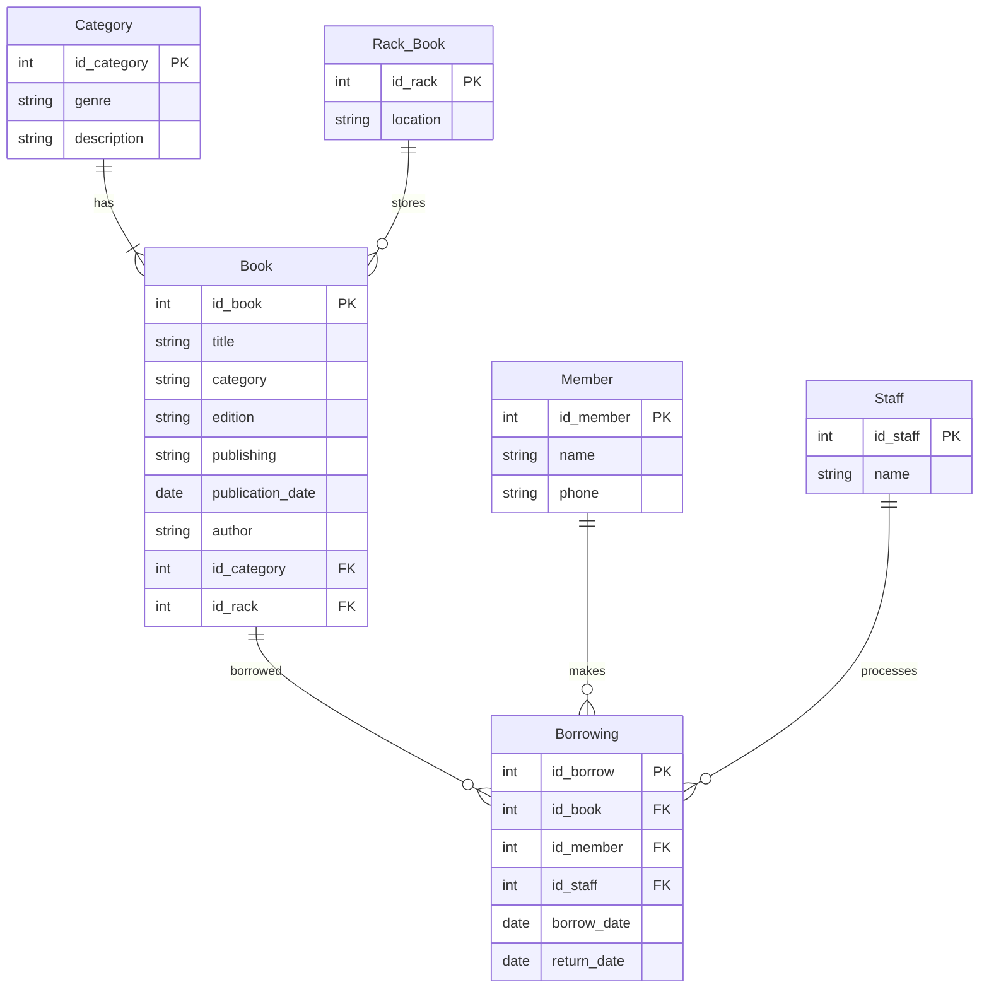

```mermaid
erDiagram

    Book {
        int id_book PK
        string title
        string category
        string edition
        string publishing
        date publication_date
        string author
        int id_category FK
        int id_rack FK
    }

    Category {
        int id_category PK
        string genre
        string description
    }

    Rack_Book {
        int id_rack PK
        string location
    }

    Staff {
        int id_staff PK
        string name
    }

    Borrowing {
        int id_borrow PK
        int id_book FK
        int id_member FK
        int id_staff FK
        date borrow_date
        date return_date
    }

    Member {
        int id_member PK
        string name
        string phone
    }

    Category ||--|{ Book : "has"
    Rack_Book ||--o{ Book : "stores"
    Book ||--o{ Borrowing : "borrowed"
    Member ||--o{ Borrowing : "makes"
    Staff ||--o{ Borrowing : "processes"

```
